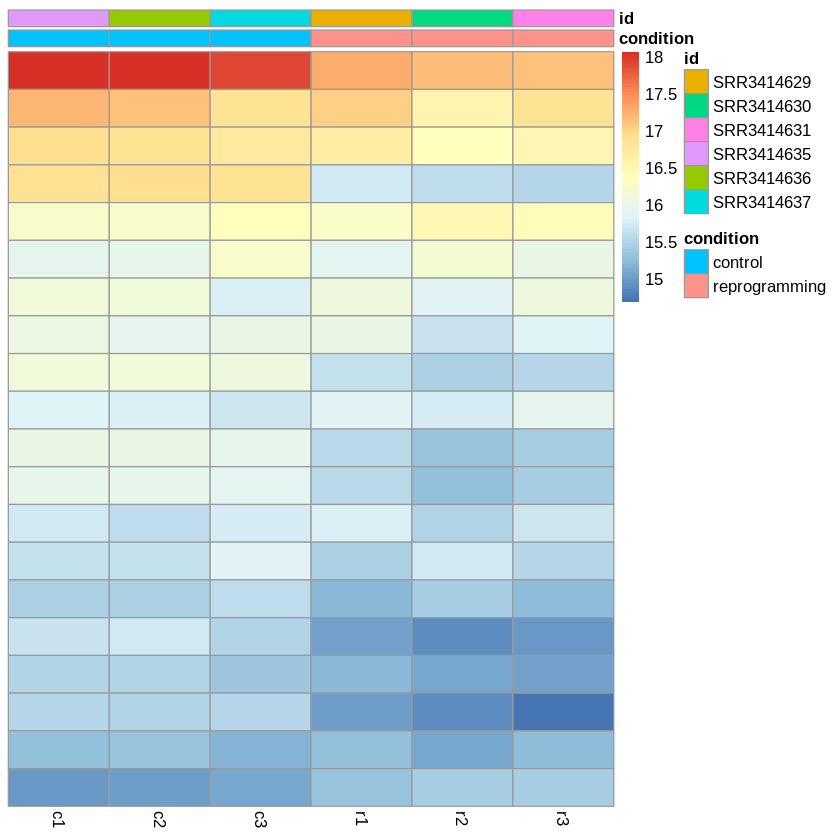

## Колаб 1

https://colab.research.google.com/drive/1m2_Ff3rBi_SFW4Mc9b_-ZYbgP4ZpS6Io?usp=sharing
таблицы приведены в колабе
## Результаты MultiQC

## Количество уникально картированных чтений по каждому образцу

## Статистика HTSeq

## Откуда получим

## Сводная таблица

Образец | Тип | Количество чтений | Успешно откартированные | Уникально откартированные | Кол-во чтений на ген
-|-|-|-|-|-
SRR3414629 | reprogrammed | 21106089 |	20510113 (97.18%)	|	18375888 (87.06%)  | 16049609
SRR3414630 | reprogrammed |	15244711 | 14832680 (97.30%)	|	13186139 (86.50%) |	11465324
SRR3414631 | reprogrammed | 24244069 | 23547686 (97.13%) | 20928945 (86.33%) |	18408851
SRR3414635 | control | 20956475 |	20395865 (97.32%)	| 18428317 (87.94%) |	16275997
SRR3414636 | control | 20307147 |	19757059 (97.29%)	| 17825380 (87.78%) |	15757580
SRR3414637 | control | 20385570 |	19847291 (97.36%)	| 17844858 (87.54%) |	15736978

## Запишем ALL.counts

## Колаб дополнительный

https://colab.research.google.com/drive/1N6dGlkrLDegTp4-qxAGkDTEZQurKhmLb?usp=sharing

## Графики доп. колаба

